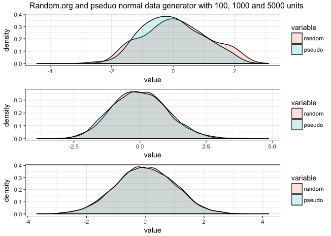

Power of number
================

``` r
#loading library
library(ggplot2) #visualise
library(httr) #getting url
library(gridExtra) #arrange plot
library(reshape2) #data processing

url='https://api.random.org/json-rpc/1/invoke'
key = '450a8610-73af-4c5c-a407-a28aaf2ed9fa'
key2 = '5a008924-195f-457e-aaf5-bf102cfa018d'

#normal data generator
generateGaussians <- function(apiKey, n, mean, standardDeviation, significantDigits, id=FALSE) {
  body <- list(
    jsonrpc="2.0",
    method="generateGaussians",
    params=list(
      apiKey=apiKey,
      n=n,
      mean=mean,
      standardDeviation=standardDeviation,
      significantDigits=significantDigits
    ),
    id=id
  )
  response <- POST(url, body = body, encode = "json")
  content <- content(response, "parsed")
  content
}

# generating normal data from Random.org
a.100 = generateGaussians(key, 100, 0,1,2,id=FALSE)
data = unlist(a.100$result$random$data)

a.1000 = generateGaussians(key, 1000, 0,1,2,id=FALSE)
data1 = unlist(a.1000$result$random$data)

a.5000 = generateGaussians(key2, 5000, 0,1,2,id=FALSE)
data1.1 = unlist(a.5000$result$random$data)

#Pseudo number generator
b.100 = round(rnorm(100, mean=0, sd=1),2)
b.1000 = round(rnorm(1000, mean=0, sd=1),2)
b.5000 = round(rnorm(5000, mean=0,sd=1),2)

#data frame random.org
random.org = data.frame(data)
random.org1= data.frame(data1)
random.org5=data.frame(data1.1)

#rename the variables
colnames(random.org) = c("random")
colnames(random.org1) = c("random")
colnames(random.org5) = c("random")

#data frame the data
pseudo.100 = data.frame(b.100)
pseudo.1000 = data.frame(b.1000)
pseudo.5000 = data.frame(b.5000)

#rename the variable
colnames(pseudo.100) = c("random")
colnames(pseudo.1000) = c("random")
colnames(pseudo.5000) = c("random")
```

``` r
#observing 100 point of data
random_pseudo.100 = cbind(random.org, pseudo.100)
colnames(random_pseudo.100) = c("random", "pseudo")
```

``` r
#observing 1000 units of data
random_pseudo.1000 = cbind(random.org1, pseudo.1000)
colnames(random_pseudo.1000) = c("random", "pseudo")
```

``` r
#observing 5000 units of data
random_pseudo.5000 = cbind(random.org5, pseudo.5000)
colnames(random_pseudo.5000) = c("random", "pseudo")

#melt data
r_p100 = melt(data.frame(random_pseudo.100))
```

    ## No id variables; using all as measure variables

``` r
r_p1000 = melt(data.frame(random_pseudo.1000))
```

    ## No id variables; using all as measure variables

``` r
r_p5000 = melt(data.frame(random_pseudo.5000))
```

    ## No id variables; using all as measure variables

``` r
#factor data
r_p100$variable<-as.factor(r_p100$variable)
r_p1000$variable<-as.factor(r_p1000$variable)
r_p5000$variable<-as.factor(r_p5000$variable)
```

``` r
#visualising the data
#100 units
random.100 = ggplot(r_p100, aes(fill = variable, xmin = value-2, ymin = value+1, xmax = value+1, ymax = value+1, value)) + geom_density(alpha = 0.2)+theme_bw()

#1000 units
random.1000 = ggplot(r_p1000,aes(fill = variable, xmin = value-1, ymin = value+1, xmax = value+1, ymax = value+1, value)) + geom_density(alpha = 0.2)+theme_bw()

#5000 units
random.5000 = ggplot(r_p5000,aes(fill = variable, xmin = value, ymin = value, xmax = value, ymax = value, value)) + geom_density(alpha= 0.2)+theme_bw()

grid.arrange(random.100, random.1000, random.5000, top = " Random.org and pseduo normal data generator with 100, 1000 and 5000 units")
```


